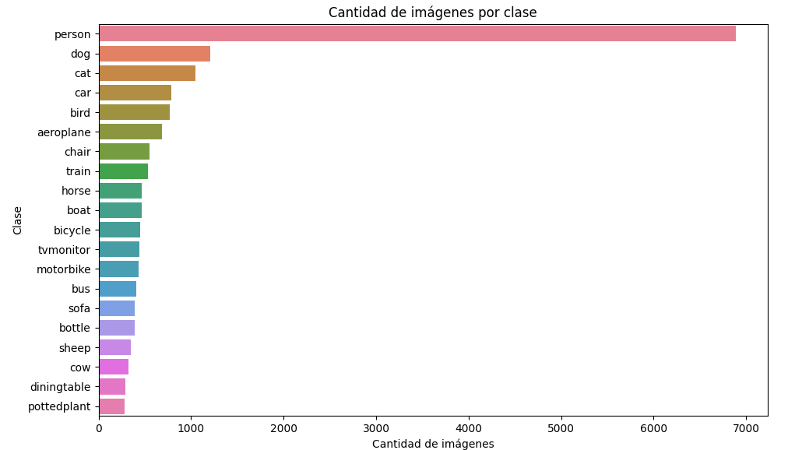
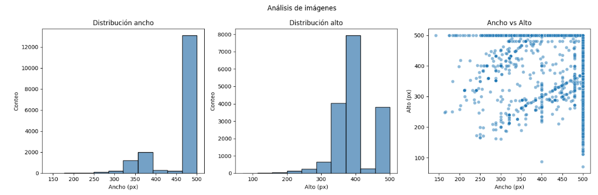
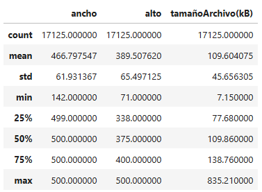

# Reporte Tecnico TP IA 2026

**Nombre de la materia**: Inteligencia Artificial  
**Catedra**: 5K4  
**Cuatrimestre**: Marzo - Junio  
**Año**: 2026 

## Análisis del Dataset (EDA)
### Estadisticas basicas
**Cantidad de imagenes**: 17125  
**Cantidad de clases**: Se encontraron 20 clases distintas

se puede observar que hay un gran desbalance de la clase persona teniendo mas de 6000 imagenes correspondientes a esa categoria mientras que las demas clases tienen entre 300 y 1200 imagenes.  
**Dimensiones**: 

* Más de 12 mil imagenes tienen un ancho de entre 450 y 500 pixeles.
* La media de alto es 389,5 pixeles.
* Ninguna imagen supera los 500 pixeles de alto o ancho.
* La media de peso de los imagenes es de 109,6 kB.  
## Metodologia
### Baseline
### Reformulación con LLM

